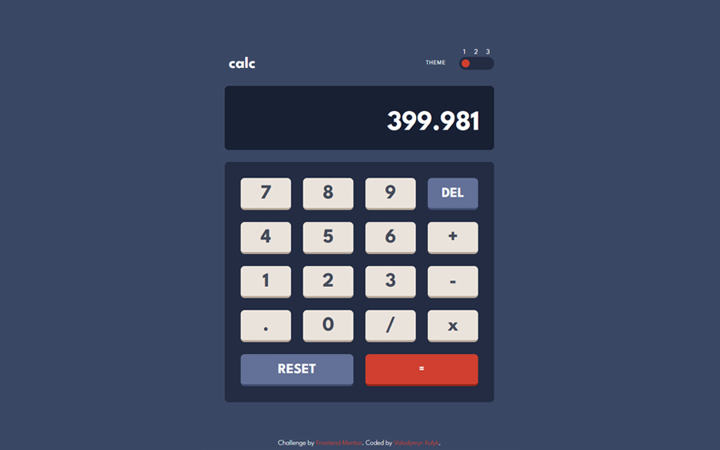

# Frontend Mentor - Calculator app solution

This is a solution to the [Calculator app challenge on Frontend Mentor](https://www.frontendmentor.io/challenges/calculator-app-9lteq5N29). Frontend Mentor challenges help you improve your coding skills by building realistic projects.

All requirements for this challenge can be found here: [src/design](./src/design).

- Live Site URL: [GitHub Pages](https://kulyk-volodymyr.github.io/Frontend-Mentor-Calculator-App/)
- Solution URL: [Frontend Mentor](https://www.frontendmentor.io/solutions/calculator-with-keyboard-input-iin-837Z1H)

### Screenshot

### About App

This app is build with:

- Semantic HTML5 markup
- CSS custom properties
- Flexbox
- CSS Grid
- Mobile-first workflow
- [React](https://reactjs.org/) - JS library

When I was developing this calculator, the most interesting part was processing user actions. Among them I would like to highlight the following:

- the user can’t enter more than one zero at the beginning of the number
- the user can’t enter more than one point
- before entering the second number, the user can change the mathematical operation
- a message appears when dividing by zero, and you can change the action or number

Another important thing is the inaccuracy of operations with decimal numbers. It is processed using the [decimal.js](https://github.com/MikeMcl/decimal.js).

In addition to the basic requirements, I also implemented the animation of the buttons when they are pressed and the input of numbers and actions from the keyboard.
